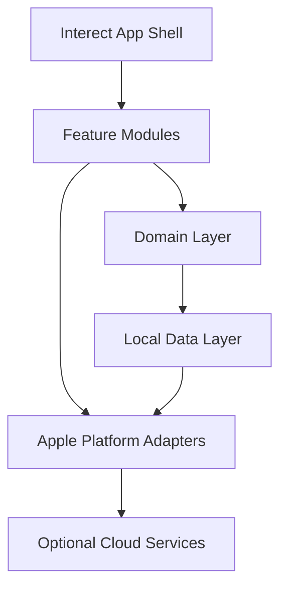
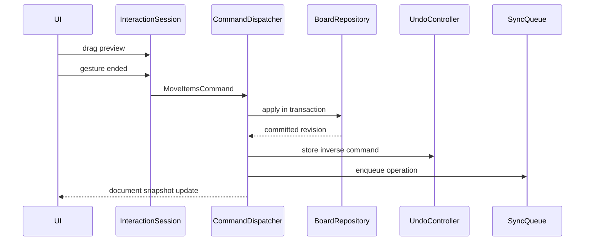

# Interect Architecture

- 상태: Proposed
- 기준일: 2026-07-18
- 적용 범위: Interect 1.0 기반 아키텍처
- 관련 문서: [PRODUCT_VISION.md](PRODUCT_VISION.md), [ROADMAP.md](ROADMAP.md), [ADR Index](docs/adr/README.md)

## 1. 목적

현재 앱은 하나의 `CanvasStore`가 문서, 선택, 뷰포트, Undo/Redo, 파일 저장을 모두 담당하고, 이미지와 파일 원본 `Data`를 포함한 전체 캔버스 상태를 UserDefaults에 JSON으로 저장한다.

이 구조는 프로토타입에는 적합하지만 다음 요구사항을 안전하게 지원하지 못한다.

- 여러 Workspace와 Board
- 대형 이미지·PDF
- 부분 저장과 복구
- 검색과 인덱싱
- 명령 단위 Undo/Redo
- 대형 보드 가상화
- 출처 연결
- 개인 iCloud 동기화
- AI 제안과 변경 이력
- 향후 협업

이 문서는 기존 프로토타입을 제품급 local-first 지식 작업 공간으로 전환하기 위한 경계와 계약을 정의한다.

## 2. 아키텍처 원칙

1. **도메인 모델은 UI 프레임워크와 분리한다.**
2. **영구 문서 상태와 세션 UI 상태를 분리한다.**
3. **모든 문서 변경은 명령으로 표현한다.**
4. **대용량 바이너리는 DB 밖의 AssetStore에 저장한다.**
5. **로컬 데이터베이스가 source of truth다.**
6. **CloudKit은 동기화 계층이지 앱의 주 저장소가 아니다.**
7. **AI 결과는 문서 변경이 아니라 적용 가능한 Proposal이다.**
8. **캔버스는 보이는 영역만 렌더링한다.**
9. **마이그레이션, 복구, 내보내기는 첫 버전부터 설계한다.**
10. **모든 플랫폼 기능은 availability와 fallback을 가진다.**

## 3. 상위 구조



```text
InterectApp
├── AppShell
│   ├── Navigation
│   ├── Window Management
│   ├── Dependency Container
│   └── App Lifecycle
├── Features
│   ├── Library
│   ├── Canvas
│   ├── SourceReader
│   ├── Search
│   ├── Intelligence
│   ├── Export
│   ├── Sync
│   └── Settings
├── Domain
│   ├── Models
│   ├── Commands
│   ├── Queries
│   └── Services
├── Data
│   ├── Database
│   ├── AssetStore
│   ├── SearchIndex
│   ├── Migration
│   └── SyncState
└── Platform
    ├── PencilKit
    ├── PDFKit
    ├── Vision
    ├── CoreSpotlight
    ├── CloudKit
    ├── FoundationModels
    └── AppIntents
```

## 4. 상태 분리

### 4.1 영구 상태

`BoardDocument`와 Repository가 소유한다.

- Workspace
- Board
- BoardItem
- TextBlock
- Asset metadata
- SourceAnchor
- Edge
- Frame
- Portal
- InkChunk
- Scene
- Tag
- Operation
- Revision

### 4.2 세션 상태

`CanvasSession`이 소유하며 기본적으로 저장·동기화·Undo 대상이 아니다.

- 현재 선택
- hover 대상
- 편집 중인 객체
- drag/resize preview
- lasso path
- 열린 Inspector tab
- 임시 AI preview
- context menu 위치

### 4.3 뷰포트 상태

`ViewportState`는 기기·창별 상태다.

- pan offset
- scale
- focus anchor
- visible rect
- active scene

기본 정책은 보드 콘텐츠와 분리 저장하며 다른 기기로 동기화하지 않는다. 사용자가 생성한 Scene만 문서 데이터로 취급한다.

## 5. 도메인 모델

### 5.1 핵심 엔터티

| 엔터티 | 책임 |
|---|---|
| Workspace | 프로젝트, 공유, 동기화의 경계 |
| Board | 하나의 공간 문서 |
| BoardItem | 모든 캔버스 객체의 공통 기하와 상태 |
| TextBlock | 텍스트와 서식 |
| Asset | 이미지·PDF·문서·오디오 메타데이터 |
| SourceAnchor | 원본의 정확한 위치와 재연결 정보 |
| Edge | 객체 사이의 의미 관계 |
| Frame | 공간 그룹과 계층 |
| Portal | 다른 Board 또는 Frame 참조 |
| InkChunk | 공간적으로 분할된 필기 데이터 |
| Scene | 발표 카메라와 순서 |
| Operation | 동기화 가능한 변경 단위 |
| Revision | 압축된 버전 체크포인트 |

### 5.2 BoardItem 공통 필드

```swift
struct BoardItemRecord: Identifiable, Sendable {
    let id: UUID
    let boardID: UUID
    var kind: BoardItemKind
    var frame: CGRect
    var rotation: Double
    var orderToken: String
    var parentFrameID: UUID?
    var isLocked: Bool
    var createdAt: Date
    var updatedAt: Date
    var revision: Int64
    var deletedAt: Date?
}
```

콘텐츠는 종류별 테이블에 저장한다. 공통 테이블 하나에 거대한 JSON blob을 넣지 않는다.

### 5.3 Edge

```swift
struct EdgeRecord: Identifiable, Sendable {
    let id: UUID
    let boardID: UUID
    var sourceItemID: UUID
    var targetItemID: UUID
    var relation: EdgeRelation
    var label: String?
    var style: EdgeStyle
    var createdAt: Date
    var updatedAt: Date
    var deletedAt: Date?
}
```

관계 유형은 확장 가능하되 초기 버전은 제품 문서의 정의된 집합으로 제한한다.

## 6. 저장 구조

### 6.1 권장 기술

- SQLite
- GRDB
- WAL
- 명시적 schema migration
- FTS5
- R*Tree 또는 메모리 spatial index
- 파일 기반 content-addressed AssetStore

SwiftData는 작은 앱과 단순 모델에는 적합하지만 Interect의 핵심 요구인 공간 인덱스, FTS, operation log, 세밀한 transaction, 동기화 상태 제어에는 SQLite/GRDB의 명시성이 유리하다.

### 6.2 파일 구조

```text
Application Support/Interect/
├── interect.sqlite
├── Assets/
│   └── ab/cd/<sha256>
├── Thumbnails/
├── OCRCache/
├── IntelligenceCache/
├── Recovery/
└── Logs/
```

### 6.3 Asset 정책

- 원본 바이트를 `BoardItem` 또는 UserDefaults에 저장하지 않는다.
- SHA-256을 content key로 사용한다.
- 같은 content hash는 한 번만 저장한다.
- 가져오기 완료 전에 임시 파일과 검증 단계를 둔다.
- thumbnail, OCR, preview는 재생성 가능한 파생물이다.
- 원본 삭제는 참조 수와 tombstone 정책을 거친다.

### 6.4 DB 트랜잭션 경계

하나의 사용자 명령은 하나의 원자적 DB transaction이다.

```text
Command
├── document rows update
├── operation append
├── search dirty marker
├── asset reference update
└── revision metadata update
```

검색 인덱스와 Spotlight는 transaction 성공 후 비동기 갱신한다.

## 7. 명령과 Undo/Redo

### 7.1 흐름



### 7.2 규칙

- 드래그·리사이즈 중 DB write 금지
- 제스처 종료 시 한 번 커밋
- 텍스트 편집은 debounce와 coalescing 적용
- 선택, hover, viewport는 문서 명령이 아님
- 명령은 inverse를 생성할 수 있어야 함
- AI 적용도 동일한 CommandDispatcher를 통과
- sync에서 들어온 remote operation은 로컬 Undo stack에 넣지 않음

### 7.3 초기 명령 집합

- CreateItemsCommand
- DeleteItemsCommand
- MoveItemsCommand
- ResizeItemsCommand
- RotateItemsCommand
- EditTextCommand
- ChangeStyleCommand
- CreateEdgeCommand
- UpdateEdgeCommand
- GroupItemsCommand
- MoveItemsToFrameCommand
- CreateSourceCardCommand
- ApplyIntelligenceProposalCommand

## 8. 캔버스 엔진

### 8.1 CanvasTransform

모든 좌표 변환은 하나의 타입에서 수행한다.

- screen → canvas
- canvas → screen
- screen delta → canvas delta
- zoom around screen anchor
- visible canvas rect
- fit bounds
- snap tolerance at scale

좌표 변환은 UI View 내부에 중복 구현하지 않는다.

### 8.2 렌더링 계층

```text
CanvasViewport
├── Background/Grid Layer
├── Edge/Ink Static Layer
├── Visible Item Layer
├── Selection/Guide Layer
└── Active Editing Overlay
```

- SwiftUI: visible card와 Inspector
- SwiftUI Canvas/Core Animation: 연결선, grid, selection decoration
- PencilKit: 입력 캡처
- 필요 시 Metal: 대량 잉크와 선

### 8.3 가상화

```text
viewport change
→ visible canvas rect
→ overscan rect
→ spatial index query
→ LOD decision
→ view model diff
→ visible items render
```

모든 BoardItem을 매 프레임 정렬하고 View로 만들지 않는다.

### 8.4 Level of Detail

- Far: Frame과 cluster summary
- Medium: title, tag, source type, edge
- Near: full content, annotation, controls

### 8.5 이미지와 PDF

- import 시 thumbnail을 생성한다.
- 캔버스에서는 thumbnail을 사용한다.
- 원본 decode는 확대 또는 Reader 진입 시 수행한다.
- PDF 카드마다 상시 `PDFView`를 생성하지 않는다.
- 메모리 경고 시 비가시 cache를 회수한다.

### 8.6 InkChunk

보드 전체를 하나의 거대한 drawing blob으로 저장하지 않는다.

- 입력 종료 시 board-space로 변환
- 인접 stroke를 chunk로 묶음
- chunk별 bounds와 drawing data 저장
- visible chunk만 렌더링
- lasso 편집 시 chunk split/merge

## 9. Source Reader와 SourceAnchor

### 9.1 SourceAnchor

```swift
struct SourceAnchor: Identifiable, Sendable {
    let id: UUID
    let assetID: UUID
    var locator: SourceLocator
    var selectedText: String?
    var contextBefore: String?
    var contextAfter: String?
    var sourceContentHash: String
    var reanchorStatus: ReanchorStatus
}
```

PDF locator는 다음을 포함한다.

- page index
- page-space rect 또는 line rects
- 가능한 경우 character range
- PDF display box

### 9.2 재연결

원본 파일이 바뀌면:

1. content hash 확인
2. 동일 텍스트와 문맥 검색
3. 후보 위치 점수화
4. 단일 고신뢰 후보면 자동 연결
5. 모호하면 사용자 확인
6. 실패하면 `needsReview`

### 9.3 Reader 원칙

- 보드의 Source Card와 Reader가 왕복 가능
- 선택 영역이 Reader에서 강조됨
- 여러 발췌가 연결된 위치를 표시
- PDF 전체를 캔버스 객체로 직접 편집하지 않음
- 스캔 문서는 OCR locator와 원본 이미지 좌표를 함께 저장

## 10. 검색

### 10.1 로컬 검색

FTS5 대상:

- Board title
- card title/body
- PDF extracted text
- OCR text
- file name
- tags
- edge label
- AI-generated description

### 10.2 공간 검색 결과

검색 결과는 목록뿐 아니라 다음을 지원한다.

- 결과만 강조
- 임시 보드에 펼치기
- 출처별 그룹화
- 시간순 또는 개념별 배치
- 선택 결과로 새 Board 생성

### 10.3 Core Spotlight

Board와 주요 Card를 시스템 검색에 노출한다. Spotlight 색인은 로컬 DB의 파생 인덱스이며 source of truth가 아니다.

## 11. 동기화

### 11.1 단계

1. 로컬 단일 사용자 안정화
2. 개인 iCloud 동기화
3. 공유 Workspace
4. 실시간 presence와 공동 편집

실시간 협업은 1.0 범위가 아니다.

### 11.2 CloudKit 매핑

- Workspace 하나 = custom record zone 하나
- Board, Item, Edge, Asset metadata는 같은 zone
- Asset binary는 CKAsset
- 공유는 zone-wide sharing 우선
- cross-workspace link는 UUID로 저장

### 11.3 CKSyncEngine

- 앱 시작 시 sync engine 초기화
- local operation을 pending change로 변환
- remote change를 serial event로 처리
- system fields를 로컬에 보관
- retry 가능한 오류와 사용자 조치 오류를 구분

### 11.4 충돌 정책

| 데이터 | 초기 정책 |
|---|---|
| 위치·크기·스타일 | field revision + deterministic winner |
| 태그 | add/remove set |
| 삭제 | tombstone |
| Asset | immutable content hash |
| 텍스트 | revision conflict copy |
| Edge | identity 기반 merge |

실시간 공동 텍스트가 필요해질 때 block 단위 CRDT를 별도 도입한다.

## 12. Intelligence

### 12.1 Provider 구조

```swift
protocol IntelligenceProvider: Sendable {
    func generate(_ request: IntelligenceRequest) async throws -> IntelligenceProposal
}
```

구현 후보:

- OnDeviceFoundationModelsProvider
- OptionalCloudProvider
- DisabledProvider

### 12.2 요청과 결과

```text
IntelligenceRequest
├── action
├── selectedItemIDs
├── retrievedSourceIDs
├── expectedSchema
├── privacyMode
└── language

IntelligenceProposal
├── summary
├── proposedCommands[]
├── citations[]
├── assumptions[]
├── warnings[]
└── coverage
```

### 12.3 규칙

- 모델이 DB에 직접 접근하지 않음
- 검색 도구는 필요한 카드만 반환
- 클라우드 전송 범위를 사용자가 확인
- 결과 적용 전 diff와 citation 제공
- 적용은 단일 Undo group
- availability가 없으면 기능을 숨기거나 대체 흐름 제공
- prompt와 model version별 회귀 평가 유지

## 13. 보안과 개인정보

- 사용자 원문을 analytics payload에 넣지 않는다.
- API key와 token은 Keychain에 저장한다.
- 외부 파일은 기본적으로 sandbox로 복사한다.
- 외부 참조가 필요하면 security-scoped bookmark를 사용한다.
- 파일 크기, 형식, 압축 폭탄을 검증한다.
- 클라우드 AI는 opt-in이며 선택된 자료만 전송한다.
- 데이터 export와 account data deletion 경로를 제공한다.
- crash log에서 카드 본문과 파일명을 redaction한다.

## 14. 마이그레이션

### 14.1 Legacy → V2

1. 기존 `interectnote-storage`를 Recovery에 백업
2. LegacyCanvasState decode
3. 기본 Workspace와 Board 생성
4. Note를 BoardItem/TextBlock으로 변환
5. 이미지·파일 Data를 AssetStore로 추출
6. hash, metadata, thumbnail 생성
7. DB transaction 저장
8. 객체 수와 파일 hash 검증
9. 성공 플래그 기록
10. 구버전 원본 일정 기간 보존

실패 시 기존 UserDefaults 데이터를 삭제하지 않는다.

### 14.2 마이그레이션 테스트

- empty state
- notes only
- image-heavy board
- large PDF
- corrupted JSON
- missing binary
- interrupted migration
- repeated migration attempt

## 15. 관측성과 진단

- `Logger` category: storage, canvas, import, search, sync, intelligence
- `os_signpost`: board open, visible query, render update, import, migration
- MetricKit: crash, hang, launch, memory, disk, energy
- 사용자용 Sync Diagnostics와 Export Diagnostics
- 개인정보가 제거된 support bundle

## 16. 테스트 구조

```text
Tests/
├── DomainTests
├── PersistenceTests
├── MigrationTests
├── CanvasEngineTests
├── SourceAnchorTests
├── SearchTests
├── SyncTests
├── IntelligenceContractTests
├── PerformanceTests
└── UITests
```

필수 성능 fixture:

- 1,000 items
- 5,000 edges
- 100 images
- 20 PDFs
- large ink set
- 200 MB asset
- long operation history
- offline sync backlog

## 17. 성능 게이트

- 보이지 않는 객체는 고비용 View를 만들지 않는다.
- drag/resize 중 영속 저장을 하지 않는다.
- main thread에서 전체 문서 encode를 하지 않는다.
- thumbnail 없이 원본 이미지를 목록에 decode하지 않는다.
- 보드 로딩은 metadata와 preview 우선이다.
- 성능 수치는 기준 기기와 fixture를 저장소에 고정한다.

## 18. 제안 폴더 구조

```text
Interect/
├── App/
├── Features/
│   ├── Library/
│   ├── Canvas/
│   │   ├── Engine/
│   │   ├── Interaction/
│   │   ├── Rendering/
│   │   └── Inspector/
│   ├── SourceReader/
│   ├── Search/
│   ├── Intelligence/
│   ├── Sync/
│   └── Export/
├── Domain/
│   ├── Models/
│   ├── Commands/
│   └── Services/
├── Data/
│   ├── Database/
│   ├── AssetStore/
│   ├── Migrations/
│   ├── SearchIndex/
│   └── CloudKit/
├── Platform/
├── DesignSystem/
└── Tests/
```

## 19. 외부 기술 근거

- Apple Foundation Models availability and structured generation
  - https://developer.apple.com/documentation/foundationmodels
- CloudKit CKSyncEngine
  - https://developer.apple.com/documentation/cloudkit/cksyncengine-5sie5
- CloudKit record zones and sharing
  - https://developer.apple.com/documentation/cloudkit/ckrecordzone
  - https://developer.apple.com/documentation/cloudkit/shared-records
- PencilKit
  - https://developer.apple.com/documentation/pencilkit
- PDFKit selection and page-space bounds
  - https://developer.apple.com/documentation/pdfkit/pdfselection
- SwiftData migration alternative
  - https://developer.apple.com/documentation/swiftdata/schemamigrationplan
- Core Spotlight query and semantic search
  - https://developer.apple.com/documentation/corespotlight/csuserquerycontext
- GRDB
  - https://github.com/groue/GRDB.swift
