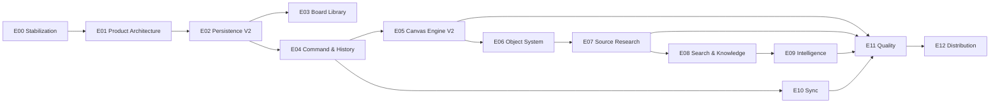

# Interect Delivery Roadmap

- 상태: Proposed
- 기준일: 2026-07-18
- 목표: 프로토타입에서 출처 연결형 local-first 지식 작업 공간 1.0까지

## 1. 실행 원칙

- 각 Phase는 이전 Phase의 exit criteria가 충족된 뒤 확장한다.
- 데이터 안전성과 캔버스 엔진을 AI와 협업보다 먼저 완성한다.
- 모든 Epic은 사용자 결과와 기술 수용 기준을 함께 가진다.
- 기능 완료가 아니라 측정 가능한 품질 게이트 통과를 완료로 본다.
- 설계 변경은 관련 ADR을 먼저 갱신한다.

## 2. 전체 순서



## 3. Phase 0 — Stabilization

### 목적

현재 앱의 P0 상호작용 오류를 제거하고 회귀를 잡을 최소 안전망을 만든다.

### 포함 Epic

- E00 Stabilization
- E01 Product Architecture

### Exit criteria

- PR #1의 캔버스 좌표·키보드·파일 가져오기 수정이 검증됨
- 단위·UI 테스트 타깃 존재
- CI에서 build와 smoke test 실행
- 현재 데이터의 수동 export 또는 recovery 경로 존재
- 핵심 ADR 승인

## 4. Phase 1 — Product Foundation

### 목적

단일 UserDefaults 캔버스를 여러 문서가 있는 안전한 local-first 앱으로 전환한다.

### 포함 Epic

- E02 Persistence V2
- E03 Board Library
- E04 Command & History

### Exit criteria

- 바이너리가 UserDefaults 또는 문서 JSON blob에 존재하지 않음
- Workspace와 Board가 독립 transaction으로 저장됨
- 기존 데이터가 검증 가능한 방식으로 마이그레이션됨
- 모든 문서 변경이 CommandDispatcher를 통과
- drag/resize 중 DB write가 발생하지 않음
- export/import round trip 통과

## 5. Phase 2 — Canvas Engine V2

### 목적

대형 보드에서도 정밀하고 일관적인 입력과 렌더링을 제공한다.

### 포함 Epic

- E05 Canvas Engine V2
- E06 Object System

### Exit criteria

- 단일 CanvasTransform 사용
- focal-point zoom과 screen/canvas round trip 테스트 통과
- viewport culling과 LOD 적용
- multi-select, lasso, align, snap, group, frame, edge 구현
- 캔버스에서 PDFView 상시 생성 제거
- 기준 fixture에서 성능 게이트 통과

## 6. Phase 3 — Differentiated Research Workflow

### 목적

Interect만의 핵심 가치를 한 번의 완결된 수직 흐름으로 증명한다.

### 포함 Epic

- E07 Source Research
- E08 Search & Knowledge

### 대표 흐름

```text
PDF import
→ text selection
→ Trace Card
→ typed relation
→ Outline
→ cited export
```

### Exit criteria

- PDF 발췌가 원문 페이지와 위치로 돌아감
- 원본 변경 시 재연결 상태를 표시
- typed edge와 Outline이 같은 문서 모델을 사용
- FTS 검색이 카드, PDF text, OCR을 포함
- 출처 포함 Markdown/PDF export 제공
- 논문 10편 규모의 사용성 테스트 완료

이 Phase가 제품의 진짜 MVP다.

## 7. Phase 4 — Intelligence

### 목적

보드를 대신 작성하는 AI가 아니라, 사용자의 근거를 구조화하고 검증하는 Spatial Copilot을 제공한다.

### 포함 Epic

- E09 Intelligence

### Exit criteria

- Provider abstraction과 availability fallback
- 선택 범위가 명확한 AI request
- citation, assumption, warning을 포함한 proposal
- 변경 전 preview와 부분 수락
- 모든 적용이 단일 Undo group
- AI 비지원 기기에서도 핵심 앱 기능 유지
- prompt/model version 회귀 평가

## 8. Phase 5 — Sync and Release Quality

### 목적

개인 기기 간 신뢰성과 출시 품질을 확보한다.

### 포함 Epic

- E10 Sync
- E11 Quality
- E12 Distribution

### Exit criteria

- offline edit와 재연결 후 증분 sync
- 충돌과 실패가 사용자에게 설명됨
- version history와 recovery
- VoiceOver Outline 탐색
- 한국어·영어 String Catalog
- MetricKit과 개인정보 보호 진단
- TestFlight onboarding과 대표 템플릿
- release checklist 통과

## 9. Epic 정의

| ID | Epic | 핵심 결과 |
|---|---|---|
| E00 | Stabilization | 현재 P0 제거, CI와 테스트 기반 |
| E01 | Product Architecture | 비전, ADR, 모듈 경계, 성능 예산 |
| E02 | Persistence V2 | GRDB, AssetStore, migration, recovery |
| E03 | Board Library | Workspace, Board, Inbox, Trash |
| E04 | Command & History | 명령 기반 저장, Undo, revision |
| E05 | Canvas Engine V2 | transform, culling, LOD, 입력 정밀도 |
| E06 | Object System | Frame, Edge, Portal, Ink, selection |
| E07 | Source Research | PDF Reader, Trace Card, SourceAnchor |
| E08 | Search & Knowledge | FTS, Spotlight, Outline, graph queries |
| E09 | Intelligence | provider, retrieval, citation, proposal |
| E10 | Sync | CKSyncEngine, conflicts, offline queue |
| E11 | Quality | 성능, 접근성, 보안, 관측성, localization |
| E12 | Distribution | onboarding, templates, TestFlight, metrics |

## 10. 출시 컷라인

### Alpha

- Persistence V2
- Board Library
- Command/Undo
- Canvas transform과 기본 가상화

### Research MVP

- Source Reader
- Trace Card
- typed edge
- Outline
- cited export

### Private Beta

- Intelligence 기본 기능
- 개인 iCloud sync
- 접근성·복구·진단

### 1.0

- 대표 흐름 안정화
- 성능 및 데이터 안전성 게이트 통과
- 한국어·영어 출시 품질
- App Store 개인정보 및 지원 문서

## 11. 의도적으로 연기하는 항목

- 실시간 cursor와 presence
- 동시 텍스트 편집 CRDT
- 팀 관리자 기능
- 웹 편집기
- marketplace와 plugin API
- 범용 프로젝트 관리
- 모든 도형과 다이어그램 기능

## 12. 우선순위 판단 규칙

새 제안은 다음 점수로 판단한다.

1. 핵심 사용자 과업에 직접 기여하는가?
2. 출처·관계·결과물 중 하나를 강화하는가?
3. 데이터 안전성을 해치지 않는가?
4. 대형 보드 성능 예산 안에 있는가?
5. 오프라인 fallback이 있는가?
6. 접근 가능한 대체 경로가 있는가?
7. 기능이 아니라 완결된 사용자 결과를 만드는가?

3개 이상 명확히 통과하지 못하면 1.0 범위에서 제외한다.
